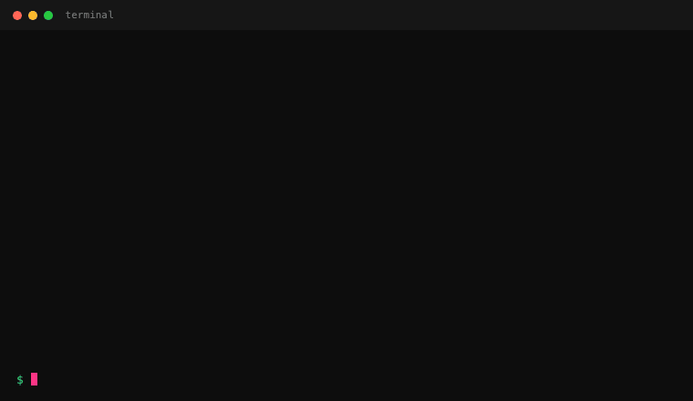

# AgentLens

**Open-source observability for AI coding agents.**
**See what your AI coding agent actually did.**

AgentLens records an AI coding-agent session and generates a polished local HTML report — what changed, what commands ran, what passed or failed, what looks risky — so you can review the agent's work before committing.

No cloud. No backend. No telemetry. Just a `.agentlens/` directory in your project.



---

## Why this exists

AI coding agents are productive — and opaque. They edit dozens of files, run scripts, install dependencies, hit some failures, retry, and hand you back a "done." Reviewing what happened means scrolling through chat transcripts and reconciling them with `git status`.

AgentLens collapses that into one local report: a single HTML page showing every shell command, every file change, every risky touch (env files, lockfiles, migrations, deletions), and a copyable Markdown summary for your PR description.

It's the "look at this before you `git commit -am 'agent stuff'`" tool.

---

## Install

Requires Node.js ≥ 18.

```bash
# from a clone (pre-publish)
git clone <this repo>
cd agentlens
npm install
npm run build
npm link
```

Once `npm link`-ed, `agentlens` is on your `$PATH`.

---

## Quickstart

```bash
# In the project the agent will work on:
agentlens init                              # one-time per project
agentlens start                             # begin recording
agentlens run -- npm test                   # record any shell command
agentlens run -- npm run build
agentlens run -- node scripts/migrate.js
agentlens stop                              # finalize and generate the report
agentlens open <run-id>                     # open the report in your browser
```

The CLI prints the report path on `stop`. You can also regenerate with `agentlens report`, list previous runs with `agentlens list`, and check live state with `agentlens status`.

---

## Commands

| Command | What it does |
|---|---|
| `agentlens init` | Create `.agentlens/` in the current directory. |
| `agentlens start` | Begin a recording session. Fails if one is already active. |
| `agentlens run -- <cmd>` | Run a shell command, stream its output, record stdout/stderr summaries + exit code into the active session. |
| `agentlens stop` | Finalize the session: capture final git state, detect risks, render the HTML report and Markdown summary. |
| `agentlens status` | Show whether a session is active and key live stats (commands recorded, live changed-file count). |
| `agentlens report` | Regenerate the report for the most recent run. |
| `agentlens list` | List finalized runs (newest first) as a table. |
| `agentlens open <run-id>` | Open that run's `report.html` in the default browser. |

`agentlens run -- <command>` executes through your shell (`/bin/sh -c "..."` on Unix, `cmd.exe /d /s /c` on Windows). Quote and escape per your shell's rules.

---

## What goes in the report

The HTML report is a single self-contained file (no CDN, no fetch on load). It contains:

1. **Review before commit** — a four-pill strip at the top: highest risk level, changed-file count, failed-command count, whether dependency/config/secret-like files were touched. This is the "look at this first" panel.
2. **Summary** — sentence-level recap of the run.
3. **Risk flags** — every risk AgentLens detected, grouped by severity.
4. **Timeline of commands** — each command with verdict (pass / fail / interrupted), duration, and expandable stdout/stderr.
5. **Changed files** — grouped by status (Added / Modified / Deleted / Renamed / Untracked).
6. **Diff stat + full diff** — full diff is collapsible.
7. **Copyable Markdown summary** — for pasting into PR descriptions.

### Risk rules

AgentLens flags:

- **High** — `.env`, credentials, `*.pem`, or secret-like files touched. Three or more commands failing.
- **Medium** — `package.json` / lockfile changes. CI config (`.github/workflows/*`, `.gitlab-ci.yml`, `.circleci/*`, `.travis.yml`, `azure-pipelines.yml`) changes. Git config (`.gitignore`, `.gitattributes`, `.gitmodules`). Migration files. Deleted files. Large diff (>500 lines or >20 files). Any failed command.

---

## Storage layout

```
your-project/
  .agentlens/
    active.json                       # in-progress run pointer (if any)
    runs/
      run_20260529T144700Z_a1b2c3/
        run.json                      # full recording
        report.html                   # generated report
```

Everything is local. Diffs > 256 KB are stored as a head + tail with a truncation marker (no gzip in v1 — JSON stays human-readable). Per-command stdout/stderr is captured as a 4 KB head + 4 KB tail with a `truncated` flag, so you never silently lose the fact that output was truncated.

Add `.agentlens/` to `.gitignore` — these recordings are local artifacts, not source.

---

## Sample output

After running `agentlens stop`:

```
✓ AgentLens run finalized.
  Run id: run_20260529T192518Z_cfnq9r
  Report: /path/to/your-project/.agentlens/runs/run_20260529T192518Z_cfnq9r/report.html
  Open it: agentlens open run_20260529T192518Z_cfnq9r
```

And `agentlens list`:

```
ID                              BRANCH        STARTED                   DURATION    CMDS  FILES RISK
run_20260529T192518Z_cfnq9r     main          2026-05-29T19:25:18.269Z  219ms       2     3     high
```

Markdown summary (copyable from the report):

```markdown
# AgentLens Run Summary

Branch: main
Commit: abc1234
Duration: 4m 12s

## What Happened
- Ran 3 commands
- Changed 5 files
- 1 command(s) failed

## Risk Flags
- High: Secret-like file touched
- Medium: package.json changed

## Commands
- npm test — failed in 12s
- npm run build — passed in 31s

## Changed Files
- src/auth.ts
- package.json
```

---

## Roadmap

- Dark theme for the HTML report
- Filter / search across runs
- Per-agent attribution (Claude, Cursor, Aider, custom)
- Optional shared dashboard for teams
- Auto-record without an explicit `start` (shell hook integration)
- Configurable risk rules per project

---

## Contributing

```bash
git clone <repo>
cd agentlens
npm install
npm test          # run the test suite
npm run build     # compile to dist/
npm run typecheck # type-only check
```

The architecture is intentionally simple — modules under `src/core/` are pure functions over the `AgentLensRun` data model; everything else (`src/git.ts`, `src/commands/*`) is a thin I/O wrapper. Tests live in `src/tests/` and target the pure layer. See `docs/spec.md` for the full design.

Issues and PRs welcome.

---

## License

MIT. See `LICENSE`.
